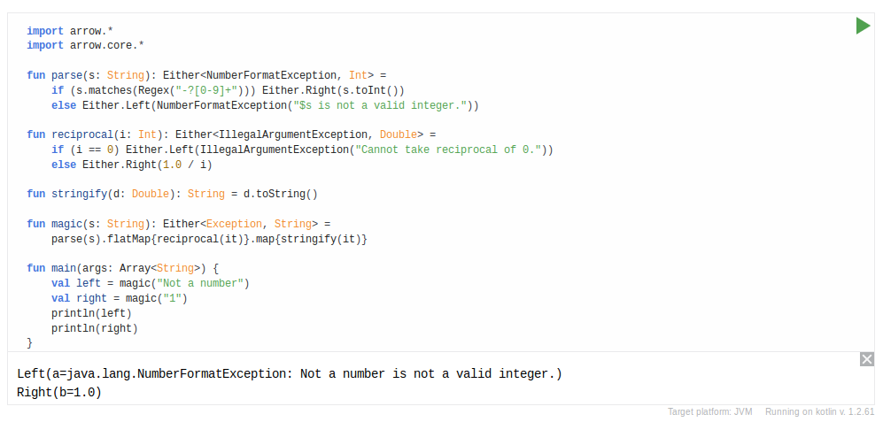

# Arrow Playground

Component that creates Kotlin-aware, including the Arrow library, editors capable of running code from HTML block elements. This is a fork of the original [Kotlin Playground](https://github.com/JetBrains/kotlin-playground) work done by JetBrains team.

[Examples](https://arrow-kt.github.io/arrow-playground/examples/)

## Preview




## Installation

### Load it from a CDN

Generate the library through the proper `npm` script, then host it and insert a `<script>` element into your page, specifying what elements should be converted in its `data-selector` attribute.

```html
<script src="https://unpkg.com/arrow-playground@1" data-selector="code"></script>
```

Or, if you need to separate process of loading/conversion, omit the `data-selector` attribute and use a second `<script>` element like this:

```html
<script src="https://unpkg.com/arrow-playground@1"></script>

<script>
document.addEventListener('DOMContentLoaded', function() {
  KotlinPlayground('.code-blocks-selector');
});
</script>
```

### Host your own instance

Install arrow-playground as dependency via NPM.

```bash
npm install arrow-playground -S
```

And then just use it in your code.

```js
// ES5
var playground = require('arrow-playground');

document.addEventListener('DOMContentLoaded', function() {
  playground('code'); // attach to all <code> elements
});


// ES6
import playground from 'arrow-playground';

document.addEventListener('DOMContentLoaded', () => {
  playground('code'); // attach to all <code> elements
});
```

<!--
### Use from plugins

1) [Kotlin Playground WordPress plugin](https://github.com/Kotlin/kotlin-playground-wp-plugin) — [WordPress](https://wordpress.com/) plugin which allows to embed interactive Kotlin playground to any post.
2) [Kotlin Playground Coursera plugin](https://github.com/AlexanderPrendota/kotlin-playground-coursera-plugin) — Allows embedding interactive Kotlin playground for [coursera](https://www.coursera.org/) lessons.
-->

### Events

Kotlin Playground supports several events on additional parameter on initialisation;

For example:
```js
function onChange(code) {
  console.log("Editor code was changed:\n" + code);
}

function onTestPassed() {
   console.log("Tests passed!");
}

const eventFunctions = {
  onChange: onChange(code),
  onTestPassed: onTestPassed,
  callback: callback(targetNode, mountNode)
};

playground('.selector', eventFunctions)

```

**Events description:**

- `onChange(code)` — Fires every time the content of the editor is changed. Debounce time: 0.5s.
 _code_ — current playground code.


- `onTestPassed` — Is called after all tests passed. Use for target platform `junit`.

- `onCloseConsole` — Is called after the console's closed.

- `onOpenConsole` — Is called after the console's opened.

- `getJsCode(code)` — Is called after compilation Kotlin to JS. Use for target platform `js`.
   _code_ — converted JS code from Kotlin.

- `callback(targetNode, mountNode)` — Is called after playground's united.
 _targetNode_ — node with plain text before component initialization.
 _mountNode_  — new node with runnable editor.

- `getInstance(instance)` - Getting playground state API.

  ```js
  instance.state      // playground attributes, dependencies and etc.
  instance.nodes      // playground NodeElement.
  instance.codemirror // editor specification.
  instance.execute()  // function for executing code snippet.
  instance.getCode()  // function for getting code from snippet.
  ```

- `getInstance(instance)` - Getting playground state API.

  ```js
  instance.state      // playground attributes, dependencies and etc.
  instance.nodes      // playground NodeElement.
  instance.codemirror // editor specification.
  instance.execute()  // function for executing code snippet.
  instance.getCode()  // function for getting code from snippet.
  ```

## Customizing editors


Use the following attributes on elements that are converted to editors to adjust their behavior.

- `data-version`: Target Kotlin [compiler version](https://try.kotlinlang.org/kotlinServer?type=getKotlinVersions):

   ```html
    <code data-version="1.0.7">
    /*
    Your code here
    */
    </code>
    ```
- `args`: Command line arguments.

  ```html
  <code args="1 2 3">
  /*
  Your code here
  */
  </code>
  ```

- `data-target-platform`: target platform: `junit`, `canvas`, `js` or `java` (default).

  ```html
   <code data-target-platform="js">
    /*
    Your code here
    */
   </code>
   ```
- `data-executable`: Editable and runnable mode, not just highlighting.

  ```html
  <code data-executable="true">
    /*
    Your code here
    */
  </code>
  ```

- `data-executable="incremental"`: Special mode where the code will be added to the code of the previous snippets, extracting `import`s and placing them at the top. Additionally this mode will wrap the executable code in a custom `main` function. So in the end what it will be executed will be something like this:

```kotlin
// All imports

fun main(args: Array<String>) {println({
  /*
  All previous snippets code
  */
  /*
  Your code here
  */
}())}

```

  ```html
  <code data-executable="incremental">
    /*
    Your code here
    */
  </code>
  ```

  You can play with this setting in this specific page where all code snippets are set in this mode:

  [Incremental mode examples](/arrow-playground/incremental/)

  Also, you can make only a part of code read-only by placing it between `//sampleStart` and `//sampleEnd` markers.
  If you don't need this just use attribute `none-markers`.
  For adding hidden files: put files between `<textarea>` tag with class `hidden-dependency`.

  ```html
  <code>
  import cat.Cat

  fun main(args: Array<String>) {
  //sampleStart
      val cat = Cat("Kitty")
      println(cat.name)  
  //sampleEnd                 
  }
    <textarea class="hidden-dependency">
      package cat
      class Cat(val name: String)
    </textarea>
  </code>
  ```
  Also if you want to hide code snippet just set the attribute `folded-button` to `false` value.

- `data-js-libs`: By default component loads jQuery and makes it available to the code running in the editor. If you need any additional JS libraries, specify them as comma-separated list in this attribute.

  ```html
  <code data-js-libs="https://my-awesome-js-lib/lib.min.js">
    /*
    Your code here
    */
   </code>
  ```

- `auto-indent="true|false"`: Whether to use the context-sensitive indentation. Defaults to `false`.

- `theme="arrow|idea|darcula|default"`: Editor IntelliJ IDEA themes.

- `mode="kotlin|js|java|groovy|xml|c|shell|swift|obj-c"`: Different languages styles. Runnable snippets only with `kotlin`. Default to `kotlin`.

- `data-min-compiler-version="1.0.7"`: Minimum target Kotlin [compiler version](https://try.arrow-kt.io:8080/kotlinServer?type=getKotlinVersions)

- `highlight-on-fly="true|false"`: Errors and warnings check for each change in the editor. Defaults to `false`.

- `autocomplete="true|false"`: Get completion on every key press. If `false` => Press ctrl-space to activate autocompletion. Defaults to `false`.

- `indent="4"`: How many spaces a block should be indented. Defaults to `4`.

- `lines="true|false"`: Whether to show line numbers to the left of the editor. Defaults to `false`.

- `from="5" to="10`: Create a part of code. Example `from` line 5 `to` line 10.

- `data-output-height="200"`: Set the iframe height in `px` in output. Use for target platform `canvas`.

- `match-brackets="true|false""`: Determines whether brackets are matched whenever the cursor is moved next to a bracket. Defaults to `true`.


## Supported keyboard shortcuts

  - Ctrl+Space		   — code completion
  - Ctrl+F9/Cmd+R	       — execute snippet
  - Ctrl+/		       — comment code
  - Ctrl+Alt+L/Cmd+Alt+L   — format code
  - Shift+Tab		   — decrease indent


## Develop and contribute

1. Install required dependencies `npm install`.
2. `npm start` to start local development server at http://localhost:9000, or `npm start -- --env.webDemoUrl=http://localhost:6666` if you want a different compiler host URL.
3. `npm run build` to create production bundles.
